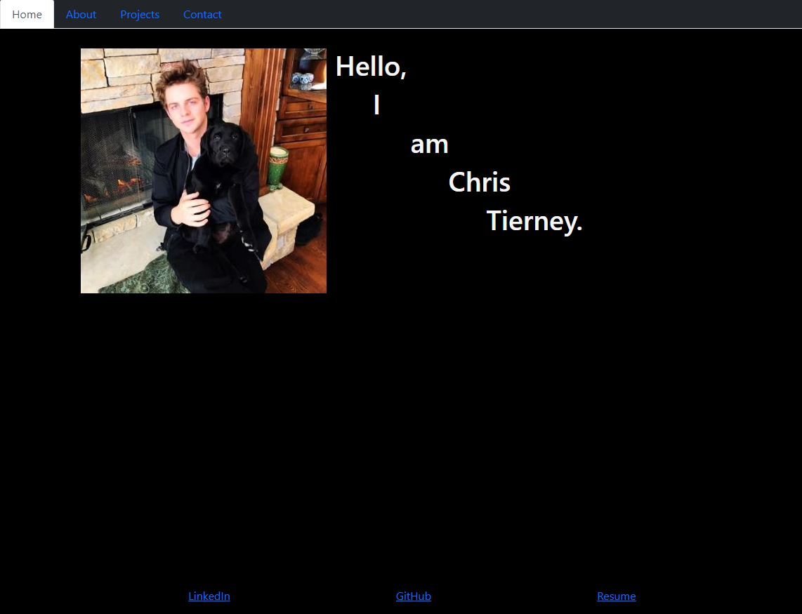
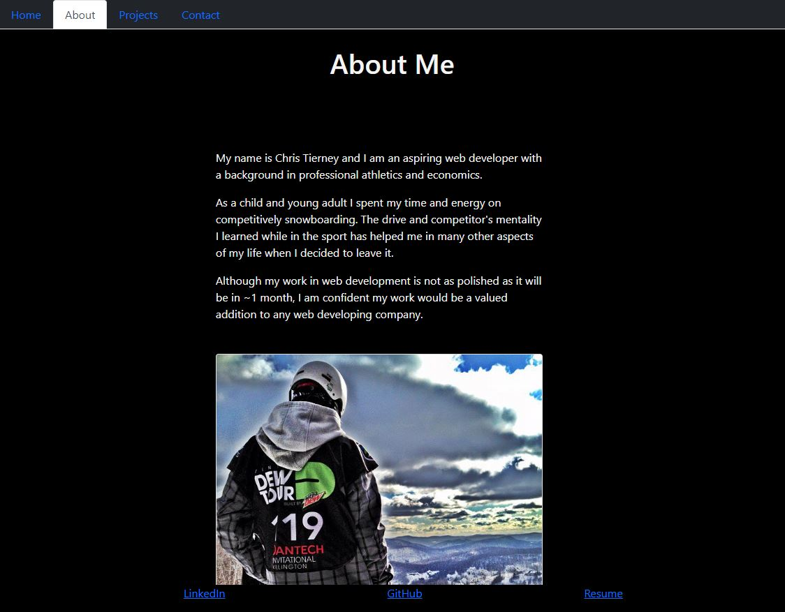
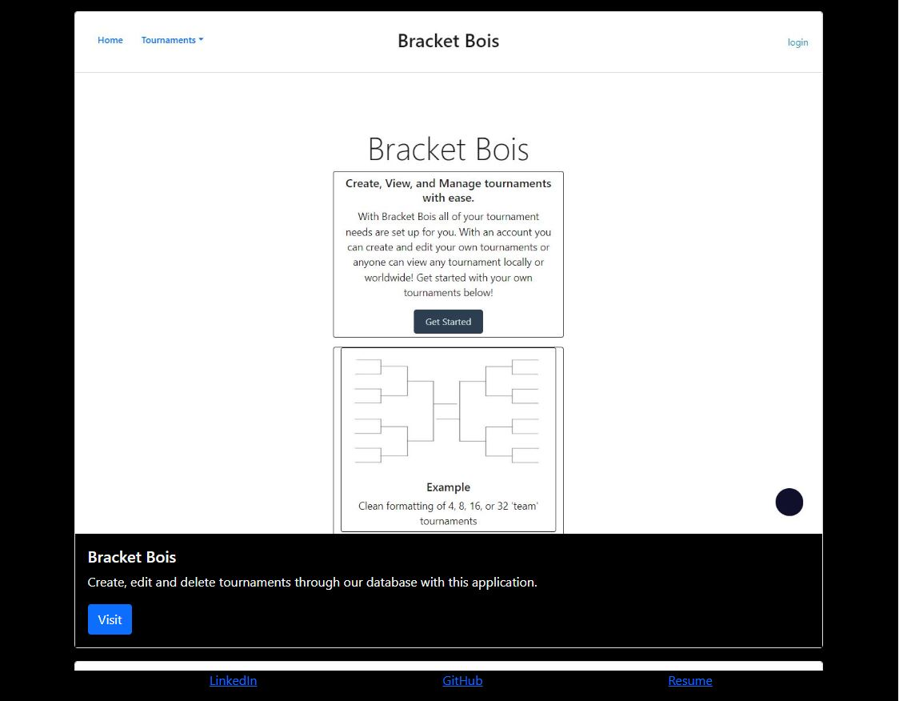
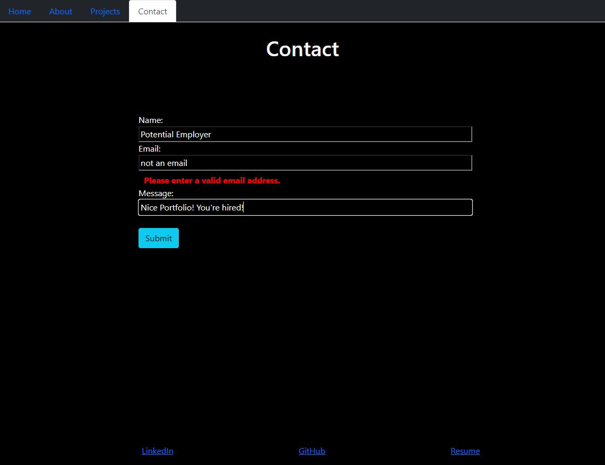

## My React Portfolio


## License description: (https://opensource.org/licenses/MIT)


## Table of Contents
* [Description](#description)
* [Installation](#installation)
* [Usage](#usage)
* [Questions](#questions)


## Description:
Here is an updated look at my developer portfolio using React!







## Installation: 
If you wish to run this application locally, simply clone this repository and run the following commands in the root directory:

```bash
npm i
```

```bash
npm run build
```

```bash
npm start
```


## Usage: 
If you'd like to see the deployed application visit [here](https://christierney3.github.io/My_React_Portfolio/)


## Questions:
If you have any questions please contact me at chris.tierney3@gmail.com or https://github.com/christierney3